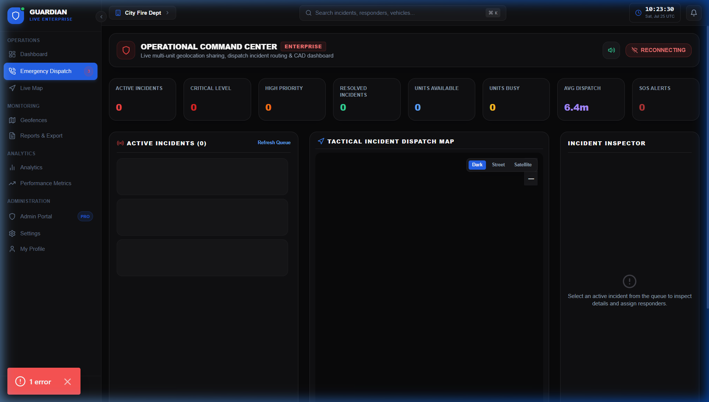
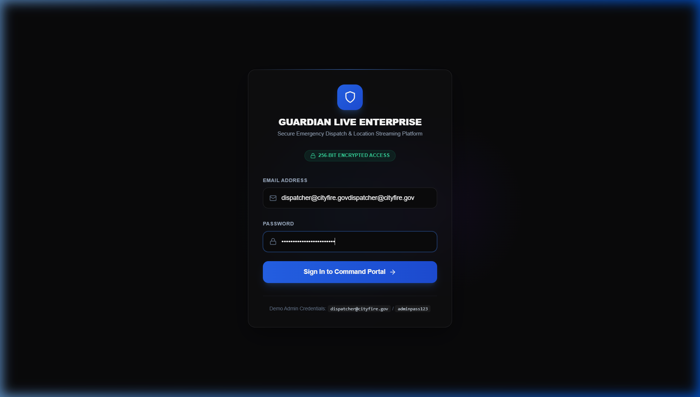

# Guardian Live Enterprise

Secure Real-Time Location Sharing & Emergency Dispatch Platform.

🚀 **Live Frontend URL**: [https://guardian-live.pages.dev](https://guardian-live.pages.dev) (Deployed on Cloudflare Pages)

## Platform Screenshots

### 🖥️ Dispatch Operations Console


### 🔑 Secure Authentication Gateway


## Core Features

- **Live Location Tracking & WebSockets**: Support for real-time geolocation streaming, adaptive intervals, heading, signal quality, and battery status.
- **Dedicated Responder Console**: A touchscreen-friendly unit terminal with live GPS tracking, navigation routes, operational status triggers, and direct dispatch messaging.
- **Intelligent Dispatch & Route Navigation**: Geodesic Haversine score recommendations for unit assignment, and multi-route rendering in Leaflet using OSRM with database-backed geometry caching.
- **Advanced Auth & Security**: RBAC + PBAC (Permission-based access control), sliding-session JWT tokens, Two-Factor Authentication, Session Revocation, rate limiting, and audit logging.
- **AI-Assisted Operations**: ETAs, anomaly detection (prolonged inactivity/abnormal movements), resource allocation recommendations.
- **Observability & DevOps**: Complete logging, Prometheus metrics, Grafana dashboards, Loki logs, Docker & Docker Compose deployment templates.

## Folder Structure

```
guardian-live-enterprise/
├── frontend/             # Next.js App Router, Dashboard components, Leaflet maps, Socket.IO client
├── backend/              # FastAPI, SQLAlchemy repositories, Socket.IO websocket, Celery background tasks
├── mobile-app/           # React Native Expo app for responders and client users
├── infrastructure/       # Nginx configurations, Prometheus, Grafana, Loki templates, K8s, Terraform
├── docs/                 # Architecture, API endpoints, database schemas, guides
└── docker-compose.yml    # Single command environment initialization
```

## Running the Platform

1. Copy `.env.example` to `.env` and fill in secrets:
   ```bash
   cp .env.example .env
   ```
2. Start the infrastructure and applications:
   ```bash
   docker-compose up --build -d
   ```
3. Run migrations and database seed script:
   ```bash
   make migrate
   make seed-db
   ```

